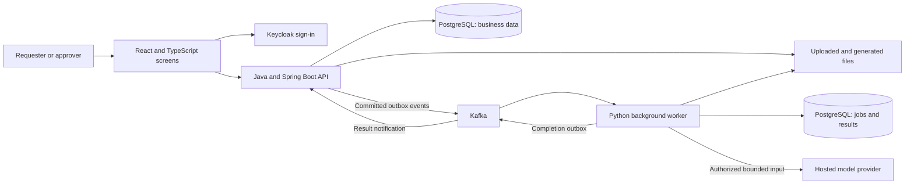

# CaseFlow Cloud: the project structure

Current local implementation, 2026-09-16. Release status and measured limitations
live in [the R2 map](r2-status.md) and [evidence index](evidence-index.md).

An employee wants to buy a $4,200 equipment package. They enter the reason,
attach a quote, and send the request through two assigned approvers. CaseFlow
keeps the request, decisions, supporting documents and audit history together.
After final approval, it generates a Word document of the approved purchase.
It does not place an order, transfer money or arrange delivery.

AI helps the employee copy information from the quote and helps reviewers find
relevant policy rules. For example, it can point out an empty cost center and
show the policy passage requiring one. The employee explicitly accepts proposed
purchase values. People still make the approval decisions.

## The system at a glance

The two database boxes are schemas in one PostgreSQL instance, with different
owners and permissions. They are not two database servers. Kafka carries work
and completion notifications; the durable job table records the work to execute.

| Part | Tool and purpose | Code entry point |
| --- | --- | --- |
| Screens | React is the UI library; TypeScript adds checked types to JavaScript | [CaseDetail.tsx](../apps/web/src/pages/CaseDetail.tsx), [Assistant.tsx](../apps/web/src/pages/Assistant.tsx) |
| Business API | Java with Spring Boot handles permissions, drafts and approvals | [CaseController.java](../services/case-api/src/main/java/dev/caseflow/cases/CaseController.java) |
| Background work | Python parses files, calls AI and renders approved documents | [runtime.py](../services/worker/caseflow_worker/runtime.py) |
| Stored relationships | PostgreSQL stores tenants, versions, jobs and audit events; SQL migrations change its structure | [db/migrations](../db/migrations) |
| Sign-in | Keycloak implements OIDC; the API separately checks current tenant membership | [Access.java](../services/case-api/src/main/java/dev/caseflow/identity/Access.java) |
| Files | SeaweedFS supplies S3-compatible local storage; AWS S3 deployment remains planned | [ObjectStorage.java](../services/case-api/src/main/java/dev/caseflow/documents/ObjectStorage.java) |
| AI evidence | Versioned synthetic inputs, raw outputs and explicit grading measure quality | [evals/README.md](../evals/README.md) |

## The important boundaries

**Java owns the business decision.** The browser can request an action, and Python
can complete a job, but neither bypasses Java's rules for approving a case.
Sign-in proves identity; database membership and case relationships determine
access. Tenant IDs in requests and hard-to-guess file IDs are not permission.

**Slow work happens after a durable request.** The API records a job request and
an outgoing event in the same database transaction. Python runs that job outside
the HTTP request. Completion travels back through another durable event. This
lets a user see queued, running or failed work without holding the page open.
The trade-off is more states, retries and recovery logic to test.

**Repeated delivery must not repeat the business effect.** Command receipts,
consumer receipts, job leases and increasing ownership tokens protect different
boundaries. They do not promise that a network message or a billed model call
happens exactly once. See [document execution](adr/0002-document-execution.md).

**Purchase facts and AI suggestions stay separate.** A quote may say $4,200 while
the draft still records $0 because no items were entered or accepted. A review
must describe the actual draft it received. Accepting suggestions requires the
matching draft version; stale results cannot silently overwrite newer edits.

**Code checks what it can know; evaluation checks meaning.** Code can verify
whether a field is empty, a quotation exists, or line items add up. It cannot
prove that every sentence correctly interprets policy merely because a citation
is valid. Review prompt v6 separates observations from obligations; review schema
v5 also rejects claims that populated fields are missing. Semantic quality still
requires separately recorded assessment.

## Why this shape?

The plan deliberately uses one Java service and one Python worker. Java keeps
business transactions together; Python uses document and AI tooling without
owning approval rules. Splitting each feature into a microservice would add more
network coordination. Running everything inside an HTTP request would instead
make document parsing and provider delays part of the user's request lifetime.

PostgreSQL text search is the current displayed-policy baseline. Exact vector
similarity and a combined ranking were evaluated as candidates. The small test
corpora do not establish a general ranking advantage, so an additional vector
database is not justified. See [retrieval decision](adr/0004-retrieval-comparison.md).

Local implementation and synthetic checks are not cloud or production readiness.
R2's assisted/manual journey and evaluation are locally complete with explicitly
experimental AI; extraction missed its quality target. Cloud and R3 recovery,
performance and operations gates remain open in the [R3 map](r3-status.md).
Read [the teaching guide](teaching-guide.md)
for the evolving reasoning and [interview preparation](interview-prep.md) for
answers grounded in actual evidence.
